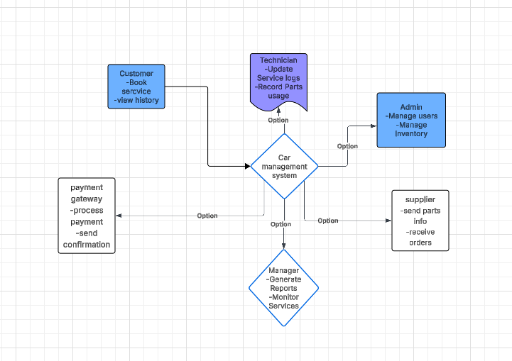

# Software Requirements Specification (SRS)

**Preface**  
This document provides the Software Requirements Specification (SRS) for the Car Service Management System (CSMS). It defines the system’s functionalities, performance criteria, security requirements, and overall system architecture necessary for development.

**Version History**

-   Version 1.0 – Initial Draft

## 1. Introduction

**Purpose**  
The Car Service Management System (CSMS) is a web-based application designed to streamline car service operations by managing appointments, service tracking, inventory, billing, and customer communication. The system enables service centers to efficiently handle workflows, improve customer experience, and optimize resource utilization.

**Document Conventions**  
This document follows the IEEE SRS standard, using:

-   **Must** – Indicates mandatory requirements.
    
-   **Should** – Indicates recommended features.
    
-   **May** – Indicates optional enhancements.
    

**Intended Audience and Reading Suggestions**

-   **Service Center Managers & Developers** – For system implementation guidance.
    
-   **Stakeholders & Business Analysts** – To understand system capabilities.
    
-   **Testers & QA Teams** – To validate compliance with requirements.
    

**Scope**  
The system provides:

-   Appointment scheduling and tracking
    
-   Vehicle service history and maintenance management
    
-   Inventory management for spare parts
    
-   Billing and invoice generation
    
-   Notifications for service updates and reminders
    
-   Customer relationship management (CRM) features
    
-   Role-based access and security features
    

**References**

-   IEEE Standard 830-1998 (Software Requirements Specification)
    
-   Internal Business Requirement Specification (BRS)
    
-   System Modeling Documentation
    

----------

## 2. Overall Description

**Product Perspective**  
CSMS is a standalone web application integrating with external services such as email, SMS gateways, and accounting software.

**Product Functions**

-   **Appointment Management:** Schedule, modify, and cancel service appointments.
    
-   **Vehicle Service Management:** Track vehicle maintenance history and service status.
    
-   **Inventory Management:** Manage spare parts stock and supplier information.
    
-   **Billing & Invoicing:** Generate invoices and receipts, integrate with payment gateways.
    
-   **Customer Communication:** Notify customers of service progress, reminders, or delays.
    
-   **Reporting & Analytics:** Generate reports on service performance, inventory levels, and revenue.
    

**User Classes and Characteristics**

-   **Admin:** Manages users, permissions, system settings, and inventory.
    
-   **Manager:** Monitors service operations, assigns tasks, reviews reports.
    
-   **Service Technician:** Updates service status, logs repairs, and manages inventory usage.
    
-   **Customer:** Books appointments, views service history, and receives notifications.
    

**Operating Environment**

-   Web-based application (accessible via Chrome, Firefox, Edge)
    
-   Cloud-hosted infrastructure
    
-   Database: MySQL or PostgreSQL
    

**Design and Implementation Constraints**

-   Compliance with GDPR, PCI-DSS, and automotive regulations
    
-   Scalability to support multiple service centers
    

**Assumptions and Dependencies**

-   Internet access is required for real-time updates
    
-   Integration with external accounting and CRM tools may be required in future versions
    

----------

## 3. System Requirements Specification

**Functional Requirements**

**User Authentication**

-   The system must allow users to register, log in, and reset passwords.
    
-   The system must enforce role-based authentication (Admin, Manager, Technician, Customer).
    

**Appointment Management**

-   Customers must be able to book, modify, and cancel service appointments.
    
-   The system must notify technicians and managers about new or updated appointments.
    

**Vehicle Service Management**

-   Technicians must log vehicle details, services performed, and parts used.
    
-   Managers must track service completion, pending tasks, and estimated service duration.
    

**Inventory Management**

-   Admins must maintain spare parts inventory, including stock levels and reorder alerts.
    
-   The system should allow tracking parts usage for each vehicle service.
    

**Billing & Invoicing**

-   The system must generate invoices for services rendered.
    
-   Invoices should include service details, parts used, labor charges, and taxes.
    
-   Customers should be able to download invoices in PDF format.
    

**Reporting & Analytics**

-   Managers must generate reports on revenue, service frequency, parts usage, and technician performance.
    
-   Reports should be exportable in PDF and CSV formats.
    

**Customer Communication**

-   The system must send notifications via email/SMS for service reminders, updates, and completion alerts.
    
-   Customers should have access to their service history and invoices online.
    

**Non-Functional Requirements**

**Performance Requirements**

-   The system must support 200+ concurrent users.
    
-   Service updates must reflect in real-time for managers and customers.
    

**Security Requirements**

-   The system must implement role-based access control.
    
-   All sensitive user data must be encrypted in transit and at rest.
    

**Usability Requirements**

-   The system should have an intuitive UI/UX suitable for customers and technicians.
    
-   Must support accessibility standards for differently-abled users.
    

**Reliability and Availability**

-   The system must ensure 99.9% uptime.
    
-   A backup mechanism must exist for disaster recovery.
    

**Maintainability and Support**

-   Modular design to support updates and new features.
    
-   Logging and debugging mechanisms for system monitoring.
    

**Portability**

-   Accessible from Windows, Mac, and Linux.
    
-   Support cloud deployment and potential mobile app integration.
    

----------

## 4. System Models

**CONTEXT DIAGRAM**

## 5. System Evolution

**Assumptions**

-   Future AI integration for predictive maintenance suggestions.
    
-   Mobile app support for customers and technicians.
    
-   Scalability to multi-branch service centers.
    

**Expected Changes**

-   Integration with third-party parts suppliers and accounting tools.
    
-   AI-powered service scheduling and parts inventory recommendations.
    

----------

## 6. Appendices

**Hardware Requirements**

-   Cloud-based infrastructure with scalable servers.
    

**Database Requirements**

-   Must maintain logical data relationships for customers, vehicles, services, inventory, and billing.
